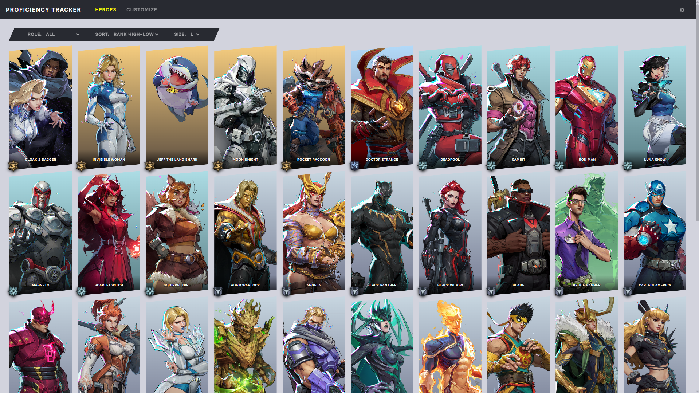

<div align="center">

# Proficiency Tracker

**Track your Marvel Rivals Hero Proficiency.**



</div>

## Usage

The easiest way is the live site:

**[johnarp.github.io/proficiency-tracker](https://johnarp.github.io/proficiency-tracker)**

Or, run it locally with any static server:

```
git clone https://github.com/johnarp/proficiency-tracker.git
cd proficiency-tracker
python -m http.server 3000
```

Then open [http://localhost:3000](http://localhost:3000)

## To Do

- [ ] Save/Import/Export with JSON & localStorage
- [x] Levels (alongside Ranks)
- [ ] Ranks shown visually on cards
- [ ] Customization
- [ ] Improved visuals and UI

## Changelog

See [CHANGELOG](CHANGELOG.md) or [Releases](https://github.com/johnarp/proficiency-tracker/releases).

## License

Source code is licensed under the [MIT License](LICENSE)

## Legal

Marvel Rivals assets, images, and related media included in this project are the property of NetEase Games and/or Marvel and are not covered by the [MIT License](LICENSE). This project is not affiliated with or endorsed by NetEase or Marvel.